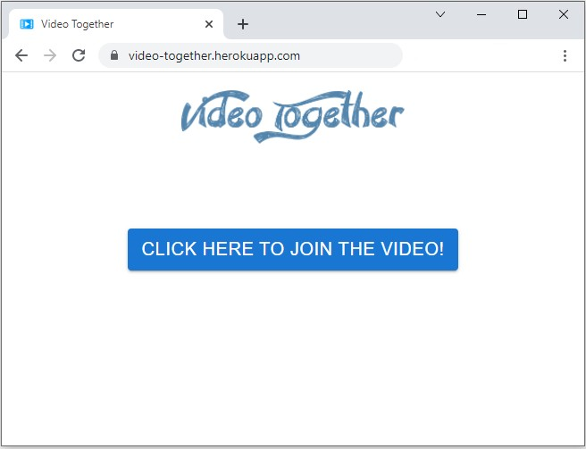
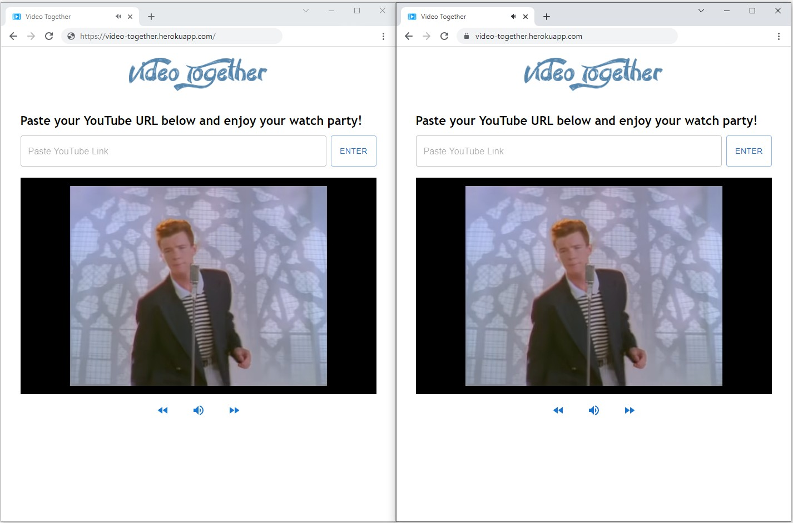

# Video Together

Video Together is a full-stack web application that syncs YouTube videos across devices. Users on different computers can watch videos together and perform synchronized controls (fast forward, mute, etc.).

The site uses [YouTube's video API](https://developers.google.com/youtube) and websockets to create an interactive and real-time web experience for its users.

## Inspiration

Throughout this past pandemic, we've been deprived of many opportunities to attend movie theatres/performances with our friends and family. As someone whose main idea of a fun night consisted of going out and watching movies, I certainly felt isolated and dispirited  during this time.

This lead to my idea for Video Together. Although it was difficult to gather with friends in-person, I decided that a valid alternative would be an online platform where we could watch videos together (from the comfort of our own homes, of course).

## Goals

After getting inspired, I developed 2 main goals for this project:

1. Video Together should allow for a low-latency means of communicating data across devices, so users see little to no delay when a user plays or controls a video.

2. Video Together should offer a diverse selection of videos and/or shows, so users can enjoy a wide range of entertainment.

## Development

My first idea during development was to use websockets with [Socket.IO](https://socket.io). Websockets would allow for real-time communication between users and the app. For example, if any user decides to fast forward/rewind a video, this information would be relayed instantly to all other users on the platform. As such, this would allow for little to no delay for users when the video is played or controlled.

My second idea was to use YouTube's video API, so users have the ability to select from the limitless amount of content available on YouTube's platform. These days, it's no secret that YouTube consumes much of our free time. As such, Video Together would offer users the opportunity to share our favourite videos with others, in real-time.

With these ideas in mind, I started developing Video Together. I started by coding the backend in Express, ensuring that the server is listening for data from the client. Then, I enabled the server to echo any data received from one client to all other clients. As a result, when one user tries to play a new video or perform an operation, this information would instantly be relayed to all other users.

Then, I started coding the frontend in React. I ensured that the client is listening for data pushed from the server, so that the frontend is updated accordingly when the server echoes video data to clients. Finally, I established the code that would allow the client to push data to the server, specifically when users play new videos or perform operations.

## Challenges

This project, however, was not without its challenges. One issue I encountered was that YouTube's video API was limited in its capacities. More specifically, the API's embedded player component would not independently recognize when users perform certain operations to the video (mute, unmute, etc.). For example, this means if one user mutes the video through the API's component, this information cannot be relayed to the other users. As such, I had to work around this limitation. Firstly, I prohibited users from interacting with the API's embedded player component. Then, I coded separate controls for the video player, so all video activity would be controlled and synchronized with all users.

  

Another issue I encountered with YouTube's API was that it prohibits videos (with sound) from auto-playing when users first load a website. Presumably, this was to protect users from pesky auto-playing ads on other websites. However, for this project, it presented a problem. Imagine two users are already watching a video together, but a third user wants to join; this third user would be prohibited under the YouTube API's auto-playing rules, because they would need to load a website that would be displaying an auto-playing video with sound. As such, I worked around this issue. I added an additional page that users would view when first loading the website. This page would include a button that allows users to join their friends watching a video, but would not play the video on their device until that button is clicked. As a result, this allowed users to join the video app at any time, without the need to display an auto-playing video when they first join.

  

## Final Result

Video Together can be accessed [here](https://video-together.herokuapp.com/).

  

## Future Roadmap

There are many ways that Video Together can continue to be improved:

1. In its current state, if a group of users all exit Video Together (but with the intention of returning later), the application will revert to playing the default video. To improve this, I could look into HTTP caching so that Video Together would remember which video was last playing and resume playing it.

2. Unfortunately, Video Together is currently susceptible to bots or other forms of automated attacks. As such, I could implement a human verification test before users can join Video Together, so bots would be filtered and handled accordingly.

## License

[Apache License 2.0](https://github.com/mat-ng/video-together/blob/main/LICENSE)
