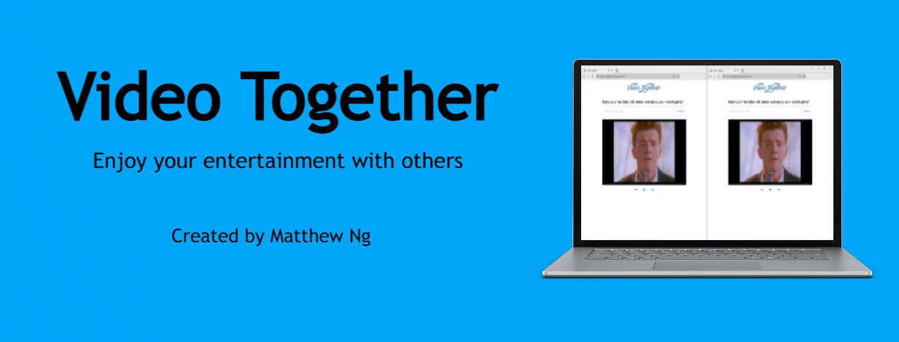

# Video Together

Video Together is a full-stack web application that syncs YouTube videos across devices. Users can watch videos together and perform synchronized controls (e.g. fast forward, mute, etc.).

The site uses [YouTube's Video API](https://developers.google.com/youtube) and websockets to create an interactive and real-time web experience for its users.

## Inspiration

Throughout this past pandemic, we've been deprived of many opportunities to visit movie theatres/performances with our friends and family. As someone whose main idea of a fun night consisted of going out and watching shows, I certainly felt isolated and dispirited  during this time.

This lead to my idea for Video Together. Although it was difficult to gather with friends in-person, I decided that a valid alternative would be an online platform where we could watch videos together (from the comfort of our own homes).

## Goals

After getting inspired, I developed 2 main goals for this project:

1. Video Together should allow for a low-latency means of communicating data across devices, so users see little to no delay when a user plays a video or adjusts playback settings.
2. Video Together should offer a diverse selection of videos and/or shows, so users can enjoy a wide range of entertainment.

## Design

My first design choice was to use websockets with [Socket.IO](https://socket.io). Websockets would allow for real-time communication between users and the app. For example, if any user decides to fast forward/rewind a playing video, this information would be relayed instantly to all other users on the platform. As such, this would allow for little to no delay for users when the video is played/adjusted, thus addressing goal #1.
